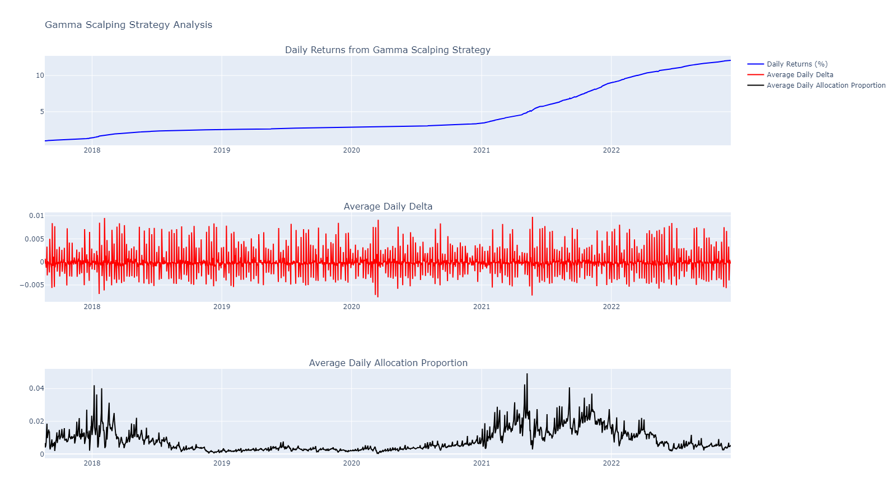

# Delta neutral strategy: ETH Gamma Scalping Strategy
(to test this strategy I use [ETH intraday data](https://www.kaggle.com/datasets/debashish311601/intraday-ether-prices?resource=download))

## Assumptions

1. **No slippage**: The market is efficient enough to allow a slippage of zero
2. **Liquidity**: Quick entry and exit without significant price impact
3. **Transaction costs**: Transaction costs associated with DEX fees are set to 0.3%
4. **BS-model assumptions**: We imply that option premiums are calculated using the Black-Scholes model. Thus, we imply all assumptions associated with the BS-model. Note that these assumptions can be relaxed, if option premiums are captured from real-market data 

## Modeling the Strategy

Gamma scalping is a delta-neutral trading strategy that involves dynamically adjusting a position in the underlying asset to maintain a neutral delta while capturing profits from changes in volatility.

At inception:
1. **Short an ETH option**. Every monday at 00:00:00 short an option expiring in 7 days
2. **Calculate delta**. Derive the sensitiviy of an option to an underlying
3. **Buy ETH**. Buy delta worth of ETH

During tenor:
1. **Recalculate delta**. Recalculate the new delta of an option
2. **Adjust ETH position**. Buy/sell ETH in order to perserve delta-neutrality

## Potential Risks

1. **Delta Risk**: Big jumps in delta can lead to deviations from delta neutrality
2. **Execution Risk**: Delays in executing trades can result in slippage and reduced profitability.
4. **Model Risk**: The strategy relies havely on the accuracy of the models used for delta calculations, they might not be effective

## Results

### Highlights

- Average Daily Return: **0.0013**
- Value at Risk (VaR) at 95% Confidence Level: **-0.0023**
- Conditional Value at Risk (CVaR): **-0.0058**
- Hypothesis test against 20% APY:
    - Z-Score for Hypothesis Test: **12.8520**
    - P-Value for Hypothesis Test: **0.0000**

Based on the results, we can **reject the null hypothesis**, indicating that the strategy does achieve at least **20% APY on average**.
